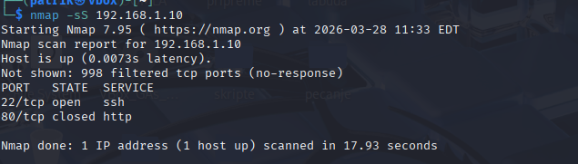
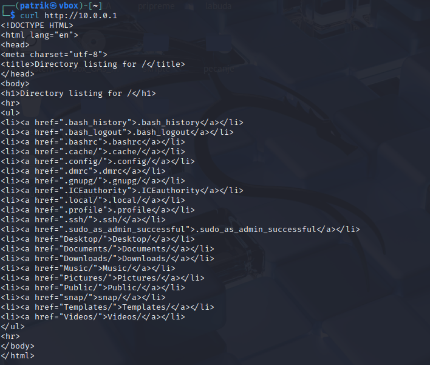
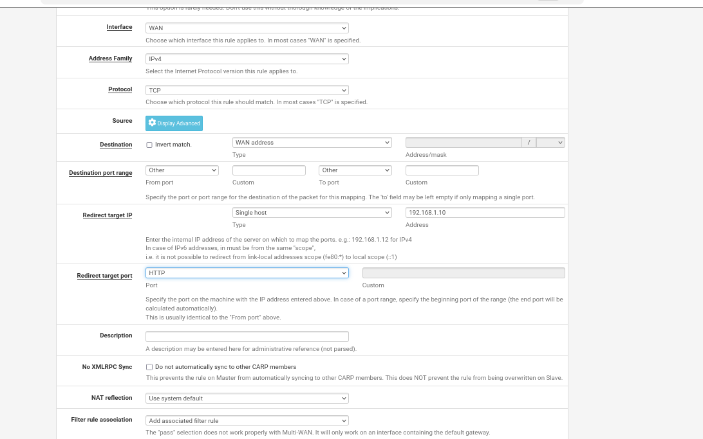
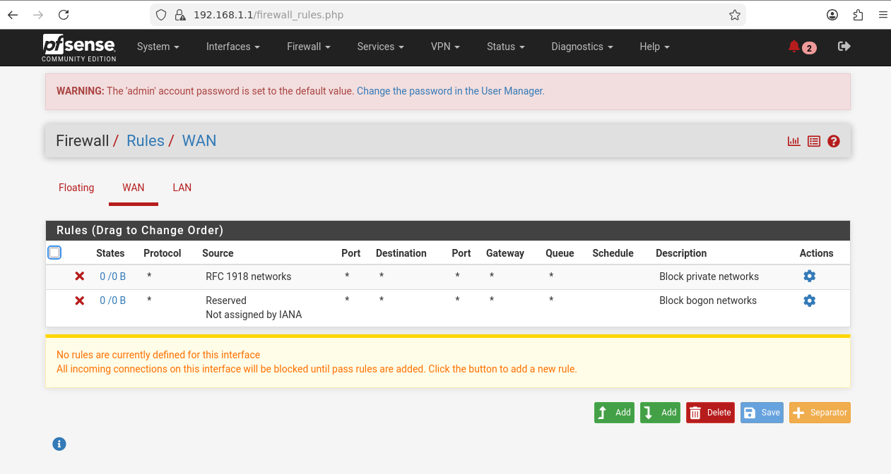
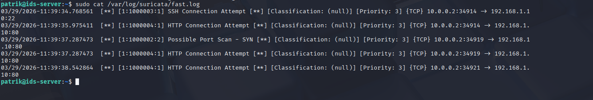
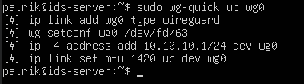
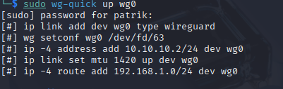
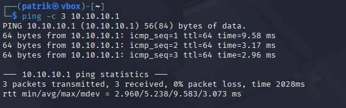
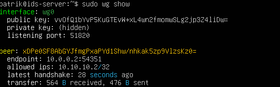

# Linux Home Lab Security Network

A hands-on network security lab built with real Linux systems and virtualized infrastructure. This project implements a segmented network with a pfSense firewall, Suricata IDS (Intrusion Detection System), and WireGuard VPN — all running on VirtualBox.

Built as a personal learning project.

---

## Project Overview

This lab simulates a real-world enterprise security setup: an untrusted external zone (WAN), a firewall controlling traffic between zones, a protected internal network (LAN) with intrusion detection monitoring, and a VPN for secure remote access.

```
                          ┌──────────────────────────────────────────────────┐
                          │              ENCRYPTED VPN TUNNEL                │
                          │          (WireGuard - 10.10.10.0/24)            │
                          └──────────────────────────────────────────────────┘

┌──────────────┐       ┌─────────────────────┐       ┌──────────────────────┐
│              │       │                     │       │                      │
│  Kali Linux  │       │   pfSense Firewall  │       │   Ubuntu Server      │
│  (Attacker)  │◄─────►│                     │◄─────►│   (IDS + VPN)        │
│              │       │  WAN: 10.0.0.1      │       │                      │
│  10.0.0.2    │       │  LAN: 192.168.1.1   │       │  192.168.1.10        │
│              │       │                     │       │  VPN: 10.10.10.1     │
└──────────────┘       └─────────────────────┘       └──────────────────────┘
        │                        │                            │
   WAN Network              Firewall                    LAN Network
  10.0.0.0/24          (Default Deny Policy)        192.168.1.0/24
                      NAT Port Forwarding
                     Traffic Filtering (ICMP,
                       SSH, HTTP rules)
```

### Network Segments

| Segment | Subnet | Purpose |
|---------|--------|---------|
| WAN | 10.0.0.0/24 | Untrusted external network (simulates the internet) |
| LAN | 192.168.1.0/24 | Protected internal network |
| VPN | 10.10.10.0/24 | Encrypted tunnel between remote client and internal server |

### Machines

| Machine | OS | IP Address | Role |
|---------|-----|------------|------|
| pfSense-Firewall | FreeBSD (pfSense) | WAN: 10.0.0.1 / LAN: 192.168.1.1 | Firewall, router, NAT gateway |
| Ubuntu-IDS-Server | Ubuntu Server 24.04 | 192.168.1.10 / VPN: 10.10.10.1 | IDS (Suricata), VPN server (WireGuard) |
| Kali-Attacker | Kali Linux | 10.0.0.2 / VPN: 10.10.10.2 | Penetration testing, attack simulation |

---

## Phase 1: Network Topology

Built a segmented virtual network in VirtualBox using internal networks to isolate WAN and LAN traffic. pfSense acts as the router/firewall between zones with two network interfaces — one on each segment.

Each machine was configured with static IP addressing. Ubuntu Server uses netplan for network configuration, while Kali uses `/etc/network/interfaces`.

**Key configuration files:**

Ubuntu Server — `/etc/netplan/50-cloud-init.yaml`:
```yaml
network:
  version: 2
  ethernets:
    enp0s3:
      dhcp4: false
      addresses:
        - 192.168.1.10/24
      routes:
        - to: 0.0.0.0/0
          via: 192.168.1.1
```

Kali Linux — `/etc/network/interfaces`:
```
auto eth0
iface eth0 inet static
    address 10.0.0.2
    netmask 255.255.255.0
    gateway 10.0.0.1
```

**Connectivity verification:**



---

## Phase 2: Firewall Configuration

pfSense enforces a **default deny** policy — all traffic between WAN and LAN is blocked unless explicitly permitted. Firewall rules and NAT port forwarding were configured through the pfSense web GUI, accessed from the Ubuntu Server via Firefox.

### Firewall Rules (WAN Interface)

| # | Action | Protocol | Source | Destination | Port | Description |
|---|--------|----------|--------|-------------|------|-------------|
| 1 | Pass | ICMP | Any | WAN address | — | Allow ping to firewall |
| 2 | Pass | TCP | Any | 192.168.1.10 | 22 | Allow SSH to Ubuntu Server |
| 3 | Pass | ICMP | Any | 192.168.1.10 | — | Allow ping to Ubuntu Server |
| 4 | Pass | TCP | Any | 192.168.1.10 | 80 | Allow HTTP to Ubuntu Server |
| — | Block | * | * | * | * | Default deny (implicit) |

### NAT Port Forwarding

| Protocol | WAN Port | Redirect Target | Target Port | Description |
|----------|----------|-----------------|-------------|-------------|
| TCP | 22 | 192.168.1.10 | 22 | SSH to Ubuntu Server |
| TCP | 80 | 192.168.1.10 | 80 | HTTP to Ubuntu Server |
| UDP | 51820 | 192.168.1.10 | 51820 | WireGuard VPN |

### Default Deny Verification

HTTP (port 80) — allowed by rule:


HTTPS (port 443) — blocked (no rule exists):


**Important discovery:** pfSense has hidden default rules that block all traffic from private/bogon IP ranges on the WAN interface. Since the lab uses private addressing (10.0.0.0/24) on the WAN side, these had to be disabled under **Interfaces → WAN** to allow lab traffic through. In a production environment with public IPs, these rules would remain active.



---

## Phase 3: Intrusion Detection System (Suricata)

Suricata monitors all traffic on the LAN interface and generates alerts when suspicious patterns are detected. This provides a second layer of security — the firewall controls what traffic is allowed, but Suricata watches for malicious activity within the allowed traffic.

### Configuration

Suricata was configured to monitor the LAN interface (`enp0s3`) with `HOME_NET` set to `192.168.1.0/24`.

**Custom detection rules** — `/etc/suricata/rules/local.rules`:
```
alert icmp any any -> $HOME_NET any (msg:"ICMP Ping Detected"; sid:1000001; rev:1;)
alert tcp any any -> $HOME_NET any (msg:"Possible Port Scan - SYN"; flags:S,12; threshold:type threshold, track by_src, count 3, seconds 60; sid:1000002; rev:2;)
alert tcp any any -> $HOME_NET 22 (msg:"SSH Connection Attempt"; flags:S; sid:1000003; rev:1;)
alert tcp any any -> $HOME_NET 80 (msg:"HTTP Connection Attempt"; flags:S; sid:1000004; rev:1;)
```

### Attack Simulation and Detection

From Kali, the following attacks were launched:
- **ICMP ping** — `ping -c 3 192.168.1.10`
- **Nmap SYN scan** — `nmap -sS 10.0.0.1`
- **SSH connection attempt** — `ssh patrik@10.0.0.1`

Suricata successfully detected and logged all activity:



---

## Phase 4: WireGuard VPN

WireGuard provides an encrypted tunnel between Kali (simulating a remote worker) and Ubuntu Server. Once connected, the remote client can securely access internal LAN resources as if they were on the local network.

### Key Exchange

WireGuard uses public/private key pairs for authentication. Each machine generates its own key pair and shares only its public key with the other.

### Server Configuration (Ubuntu)

`/etc/wireguard/wg0.conf`:
```ini
[Interface]
PrivateKey = <server_private_key>
Address = 10.10.10.1/24
ListenPort = 51820

[Peer]
PublicKey = <client_public_key>
AllowedIPs = 10.10.10.2/32
```

### Client Configuration (Kali)

`/etc/wireguard/wg0.conf`:
```ini
[Interface]
PrivateKey = <client_private_key>
Address = 10.10.10.2/24

[Peer]
PublicKey = <server_public_key>
Endpoint = 10.0.0.1:51820
AllowedIPs = 10.10.10.0/24, 192.168.1.0/24
```

The `Endpoint` points to pfSense's WAN IP because NAT port forwarding redirects UDP 51820 traffic to Ubuntu Server. `AllowedIPs` routes both VPN and LAN traffic through the tunnel.

### VPN Activation and Verification

Starting the tunnel:
```bash
# On Ubuntu (server)
sudo wg-quick up wg0

# On Kali (client)
sudo wg-quick up wg0
```





Tunnel verification — ping through encrypted VPN:



WireGuard status showing active handshake and data transfer:



---

## Problems I Encountered

Building this lab was not a smooth process. Here are the key issues I ran into and what I learned from each:

### Default Route Conflicts
When temporarily adding a NAT adapter for internet access (to install packages), the system ended up with two default routes — one pointing to pfSense (no internet) and one to the VirtualBox NAT gateway (internet). Traffic would go through pfSense and fail. The fix was manually deleting the wrong default route with `sudo ip route del default via <wrong_gateway>`. This taught me how Linux routing tables work and why route priority matters in multi-homed systems.

### YAML Formatting Errors in Netplan
Ubuntu's netplan uses YAML, which is extremely sensitive to indentation and formatting. A single wrong space or a misplaced dash caused the entire network configuration to fail. For example, writing `- to:` and `- via:` as separate list items instead of a single route entry broke the config. Lesson learned: YAML formatting is not optional, and every space counts.

### Forgotten Password and Recovery
After installing the XFCE desktop environment, the graphical login screen appeared but I couldn't remember the password I had set during installation. I learned how to use GRUB recovery mode to drop into a root shell and reset the password with `passwd`. A small mistake, but it introduced me to Linux recovery procedures that are genuinely useful in real-world system administration.

---

## Tools and Technologies

| Tool | Purpose |
|------|---------|
| VirtualBox | Virtualization platform |
| pfSense | Firewall and router (FreeBSD-based) |
| Ubuntu Server 24.04 | Internal server OS |
| Kali Linux | Penetration testing and attack simulation |
| Suricata | Network Intrusion Detection System |
| WireGuard | Modern VPN tunnel |
| Nmap | Network scanning and reconnaissance |
| Wireshark | Packet analysis (used during troubleshooting) |

---

## What I Learned

- **Network segmentation** — separating trusted and untrusted zones with a firewall
- **Default deny policy** — blocking everything by default and only allowing what's needed
- **NAT port forwarding** — redirecting external traffic to internal services
- **Intrusion detection** — writing custom Suricata rules to detect specific attack patterns
- **VPN encryption** — public/private key cryptography and encrypted tunnels with WireGuard
- **Linux networking** — static IP configuration, routing tables, netplan, and multi-interface management
- **Troubleshooting** — reading error messages, checking logs, and systematically isolating problems

---

## How to Reproduce

1. Install [VirtualBox](https://www.virtualbox.org/)
2. Download ISOs: [pfSense](https://www.pfsense.org/download/), [Ubuntu Server](https://ubuntu.com/download/server), [Kali Linux](https://www.kali.org/get-kali/)
3. Create three VMs with internal networks `intnet-wan` and `intnet-lan` as described above
4. Follow the configuration steps for each phase
5. Full detailed documentation is available in `documentation/` folder

---

## Repository Structure

```
├── README.md
├── images/
│   ├── kalinmapReza.png
│   ├── pfSenseDashboard.png
│   ├── pfSenseFirewallRules.png
│   ├── pfSenseNATblokirajHTTPS.png
│   ├── kaliCurlKomanda.png
│   ├── suricataLogoviNakonPinga.png
│   ├── startanVPNUbuntu.png
│   ├── startanVPNKalipng.png
│   ├── prekoKaliPingamoUbuntuVPN.png
│   ├── statusVPNa.png
│   └── ... (additional screenshots)
├── configs/
│   ├── suricata-local.rules
│   ├── wg0-server.conf
│   └── wg0-client.conf
└── documentation/
    └── Full-Documentation.pdf
```

---

## Author

**PP**
2nd year — Tehničko veleučilište u Zagrebu (TVZ)
[GitHub](https://github.com/izscaryu) · [LinkedIn](https://www.linkedin.com/in/patrik-pauli-962b27291/)
